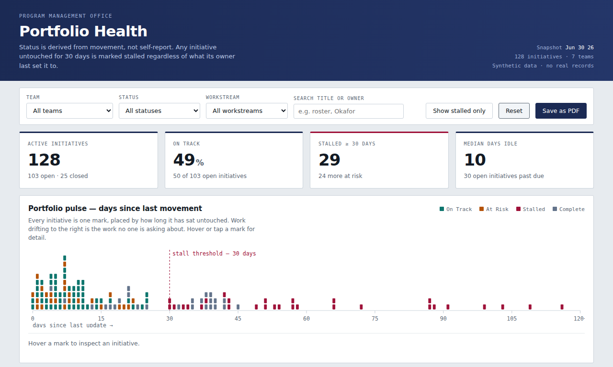

# Portfolio Health Dashboard

**[▶ Open the live dashboard](https://arpit-b-shah.github.io/portfolio-health-dashboard/)**

A single-file, zero-dependency dashboard that answers the one question a program portfolio review always comes down to: *what isn't moving, and who owns it?*



---

## The problem

Portfolio status reporting is self-reported, and self-reported status is optimistic. An initiative stays green because its owner set it to green in March and hasn't opened the record since. By the time a status meeting catches it, the slip is a quarter old.

Most portfolio tools report **stated status**. This one reports **observed movement**, and treats the gap between the two as the finding.

## What it does

- **Derives status from evidence.** Anything untouched for 30+ days is marked *Stalled* regardless of what its owner last set it to. *At Risk* is computed from schedule position against percent complete, not asserted.
- **Makes drift visible in one glance.** The portfolio pulse strip plots every initiative on a single axis of days-since-last-update. Work piling up on the right of the stall threshold is work nobody is asking about.
- **Ranks teams by trouble, not alphabetically.** The teams that need a conversation appear first.
- **Filters and drills.** By team, workstream, status, or free-text search across titles and owners. Sortable detail table, defaulted to longest-idle first.
- **Exports for the deck.** Print styles produce a clean PDF with filters stripped and cards intact — the filtered view you're looking at is the view that prints.

## Why it's built this way

**One file, no build step, no dependencies.** No npm, no CDN, no Chart.js. Charts are hand-rolled SVG. The reason is operational, not aesthetic: in a locked-down enterprise environment you cannot assume a package registry, a build server, or an approved CDN. A dashboard that is one HTML file can be emailed, dropped on a SharePoint library, or opened from a thumb drive, and it will render. That constraint drove the architecture.

**Status logic lives in one function.** [`classify()`](data/generate_sample_data.py) is the single place status is decided. Rules that live in one readable function can be argued with in a governance meeting; rules scattered across conditional formatting in forty spreadsheets cannot.

**Deterministic data.** The generator is seeded, so the committed dataset is byte-identical on every run and shows up cleanly in version control diffs.

## Data

**Every record in this repository is fabricated.** No real organization, person, program, member, provider, or performance record is used, referenced, or reconstructed. The dataset is produced by [`data/generate_sample_data.py`](data/generate_sample_data.py) from a fixed seed.

| Field | Notes |
|---|---|
| `id` | Synthetic identifier, `INI-001` … |
| `title` | Assembled combinatorially from generic action/object fragments |
| `team`, `workstream`, `owner` | Fabricated |
| `status` | **Derived**, not assigned — see `classify()` |
| `percent_complete` | Modeled against elapsed schedule with realistic slippage |
| `start_date`, `due_date`, `last_update` | Measured from a fixed snapshot date of 2026-06-30 |
| `days_since_update` | The variable the whole dashboard is organized around |

Regenerate:

```bash
python data/generate_sample_data.py --json
```

## Run it

Clone and open `index.html`. That's the whole procedure — there is no server, no install, and no build.

```bash
git clone https://github.com/arpit-b-shah/portfolio-health-dashboard.git
cd portfolio-health-dashboard
open index.html          # macOS
start index.html         # Windows
```

## Use it with your own data

1. Produce a CSV with the columns listed above.
2. Convert it to JSON and replace the `DATA` array near the top of the `<script>` block in `index.html`.
3. Update the `AS_OF` constant to your snapshot date.

Nothing else needs to change — teams, statuses, and workstreams are read from the data.

## Repository

```
index.html                        the dashboard — everything is in here
data/generate_sample_data.py      seeded synthetic data generator
data/initiatives.csv              generated dataset (committed for reviewability)
data/initiatives.json             same data, embedded form
```

## Accessibility and browser support

Keyboard-navigable filters, sort headers, and pulse marks; visible focus states; ARIA labels on chart marks; `prefers-reduced-motion` respected; responsive to mobile. Runs in any current browser with no polyfills.

## License

MIT — see [LICENSE](LICENSE).
